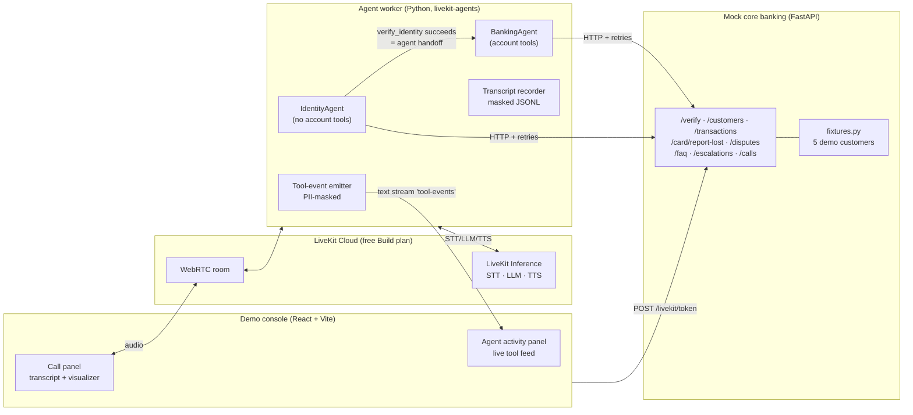

# Meridian Bank — AI Voice Agent (Proof of Concept)

A voice AI agent for retail-bank call centres, built on [LiveKit Agents](https://docs.livekit.io/agents/).
A customer speaks to the agent in the browser (production: over the phone via SIP); the agent
verifies their identity, answers balance/transaction questions, blocks lost cards, files
disputes, and hands off to a human with a full summary when it should. A two-panel demo
console shows the call **and** a live feed of every system call the agent makes — proof the
answers are grounded, not hallucinated. A **Supervisor view** shows the contact-centre
manager's side: containment rate, average handle time, escalations, and a per-call
PII-masked audit trail.

> Pitching this to a bank? [`docs/PITCH.md`](docs/PITCH.md) is the evidence pack: verified
> deployments at other banks, the security-guarantee talking points, and the SA regulatory
> position, with sources.

> **POC status:** the "core banking system" is a mock FastAPI service with fixture data.
> No real customer data, no real money movement, free-tier infrastructure only.
> [Path to production](#path-to-production) covers what changes for a real deployment.

## Architecture



**The seam a bank's engineers care about:** the agent only ever touches banking data through
`backend/`'s HTTP API. Replace the fixture-backed routers with adapters to your core-banking,
card-management, and CRM systems and the agent code does not change.

## Repo layout

```
shared/    Pydantic API models, PII redaction, structlog setup (used by both services)
backend/   Mock core-banking API (FastAPI) + LiveKit token endpoint + call records/KPIs
agent/     Voice agent worker (livekit-agents): agents, tools, events, transcripts
frontend/  Demo console (Vite + React + TS): call console + supervisor dashboard
docs/      Pitch evidence pack (PITCH.md)
```

## Quickstart

Prerequisites: [uv](https://docs.astral.sh/uv/), Node 20+, `make`. Docker optional.

1. **LiveKit Cloud project (free).** Sign up at [cloud.livekit.io](https://cloud.livekit.io),
   create a project, copy the URL + API key/secret from *Settings → Keys*. The free Build plan
   includes agent session minutes and LiveKit Inference credit for STT/LLM/TTS — **no other
   accounts or API keys needed**.

2. **Configure:**
   ```bash
   cp .env.example .env    # then fill in LIVEKIT_URL / LIVEKIT_API_KEY / LIVEKIT_API_SECRET
   ```

3. **Install & run:**
   ```bash
   make setup   # uv sync, npm install, model weights, git hooks
   make dev     # backend :8000 + agent worker + frontend :5173, hot reload
   ```

4. Open **http://localhost:5173**, pick a scenario, allow the microphone, and talk.

No browser needed for a quick check: `make console` gives you a terminal voice/text chat
with the same agent (backend must be running: `make run-backend`).

### Make targets

| Target | What it does |
|---|---|
| `make setup` / `make dev` | install everything / run all three services with hot reload |
| `make run-backend` `run-agent` `run-frontend` | run one service |
| `make console` | talk to the agent in the terminal |
| `make lint` `format` `typecheck` | ruff + eslint / formatters / mypy + tsc |
| `make test` / `make test-cov` | unit tests (no credentials needed) / with coverage |
| `make test-behavioral` | agent-behavior tests against a live LLM (needs `.env` creds) |
| `make docker-up` | full stack via docker compose (frontend on :8080) |

## Demo walkthrough (5 scripted scenarios)

Each scenario is a fixture customer in [`backend/src/bankagent_backend/fixtures.py`](backend/src/bankagent_backend/fixtures.py)
— the **only** file to edit when tailoring data for a pitch. The console shows a crib card
with the account number / ID digits so you never have to memorise them on stage.

Every call opens the same way: the agent introduces itself as an AI, notes the call may be
recorded, and will not discuss any account until you verify (say the account number and ID
digits from the crib card). Watch the right panel: **Verify identity** runs, the badge flips
to *Verified*, and only then do account tools exist at all.

| # | Scenario | Customer | Script beats |
|---|---|---|---|
| 1 | **Happy path** | Thabo Mokoena (ZAR) | Verify → "What's my balance?" → "Has my salary come in?" → watch profile + transactions tools fire. |
| 2 | **Flagged transaction** | Naledi Khumalo (ZAR) | Verify → "Anything unusual on my account?" → agent surfaces the flagged Luxembourg charge → "Dispute it" → dispute reference read back. |
| 3 | **Card declined (sensitive)** | Kagiso Tau (BWP) | Verify → "Why was my card declined at Game City?" → agent explains 94%-used credit limit tactfully, offers options. |
| 4 | **Lost card (action)** | Amogelang Seretse (BWP) | Verify → "I've lost my card" → agent confirms last 4 digits → card blocked live with reference + replacement ETA. Run it twice to show the 409 "already blocked" handling. |
| 5 | **Guardrails & handoff** | Sipho Dlamini (ZAR) | Verify → "Should I move my savings into shares?" (declines advice) → "Transfer R50k to my brother" (declines — no such tool exists) → "Let me talk to a person" → escalation ticket + amber banner, summary carried to the "human". |

Bonus beats for any scenario: ask a general question before verifying ("what are your branch
hours?") — the FAQ tool answers without account access. Try asking for a balance *before*
verifying — the agent refuses; the activity panel stays empty of account calls. Fail
verification three times — a red **Security lockout** event fires and only the human-handoff
path remains.

**After hanging up, switch to the Supervisor view** (toggle in the header): the call you just
made appears in the call log with its outcome (contained / escalated / verification failed),
duration, and a drill-down into the full masked audit trail — plus running KPIs (containment
rate, average handle time, escalations, lockouts). This is the ops story: the AI channel is
managed with the same numbers as the human one.

## How the guardrails work (not just prompts)

- **Identity gate is structural.** `IdentityAgent` — the only agent before verification —
  simply *has no account tools*. Verification success returns a `BankingAgent` handoff
  (conversation carried over). A prompt injection can't call a tool that doesn't exist.
  Belt-and-braces: every account tool re-checks `userdata.verified`, and the prompts state
  the policy for conversational leakage. Asserted in `agent/tests/test_tool_schemas.py`.
- **No money movement, structurally.** There is no transfer/payment tool on any agent; the
  prompt explains why and routes to a human.
- **Grounding.** Tools return exactly what the mock bank returned; instructions forbid
  stating account data that didn't come from a tool. Every tool call is visible in the
  activity panel with its (masked) arguments and result summary.
- **PII redaction everywhere.** Known values (whatever account number the caller says) are
  masked exactly, plus regex safety nets for SA ID / Omang / account-number shapes — applied
  to logs (structlog processor), on-disk transcripts, and the browser event stream.
- **Failure has a voice.** Backend calls get timeouts + retries (tenacity, 5xx/transport
  only); definitive failures raise `ToolError` with an instruction for what the agent should
  *say* (apologise, offer a human) instead of crashing or going silent.
- **Every session leaves a masked transcript** (`transcripts/<date>/<session>.jsonl`):
  turns, tool events, and an end-of-call summary — QA/replay ready.
- **Every call posts a structured record** to the backend at session end: outcome
  (contained/escalated/verification-failed/abandoned), verification attempts, security
  lockouts, tools used, and the masked event log — powering the Supervisor dashboard's
  KPIs and per-call audit drill-down.

## Testing

- **Unit tests** (`make test`, no credentials, run in CI on every push): backend endpoints,
  redaction, retry/timeout behaviour (respx), transcript masking, tool-schema guarantees.
- **Agent-behavior tests** (`make test-behavioral`, marker `behavioral`): LiveKit's in-process
  test harness drives the real agents with a real LLM (no STT/TTS, stubbed bank client) and
  asserts tool calls, the verification handoff, refusals, and escalation — with LLM-as-judge
  assertions for phrasing. They skip when credentials are absent; in CI they run on `main`
  pushes / manual dispatch if `LIVEKIT_*` secrets are set. Cost: pennies per run.

## Configuration

Everything is env-driven (`.env`, see `.env.example`):

| Variable | Default | Notes |
|---|---|---|
| `LIVEKIT_URL/API_KEY/API_SECRET` | — | LiveKit Cloud project; also authenticates Inference |
| `LLM_PROVIDER` | `inference` | `inference` (free credit) or `anthropic` (direct Claude) |
| `LLM_MODEL` | `openai/gpt-4.1-mini` | e.g. `claude-haiku-4-5` when provider=anthropic |
| `STT_MODEL` / `TTS_MODEL` / `TTS_VOICE` | `deepgram/nova-3` / `cartesia/sonic-3` / — | any LiveKit Inference model string |
| `BACKEND_BASE_URL` | `http://localhost:8000` | mock bank, as seen from the agent |
| `LOG_FORMAT` | `console` | `json` in containers |

Swapping to direct Deepgram/Cartesia plugins later is a new branch in
`agent/src/bankagent_agent/config.py`'s factories — one file.

## Path to production

**Core banking integration.** Keep the agent untouched; replace `backend/`'s fixture routers
with adapters to the bank's systems (customer info, card management, disputes/fraud, CRM
ticketing). The Pydantic contracts in `shared/` are the integration surface to negotiate.
The LiveKit token endpoint moves behind the bank's authenticated channel tier.

**Real telephony (inbound calls).** LiveKit supports native SIP: provision a number/SIP
trunk, add a dispatch rule that routes each call into its own room, and the same agent code
answers phones — a SIP caller is just another room participant. DTMF, transfers (cold/warm
for the human-handoff), and caller ID are supported. The escalation tool would then execute
a real transfer to the contact-centre queue instead of simulating one.

**Real identity verification.** Replace account+ID-digits simulation with the bank's actual
flows: OTP to the registered device, voice biometrics, or app-push confirmation — it slots
in as a replacement for `verify_identity` + a stronger step-up tool for sensitive actions.

**POPIA (South Africa) / Data Protection Act (Botswana).** The POC already demonstrates the
right posture: recording disclosure at call open, PII minimisation in logs/transcripts,
purpose-bound data access only after verification. Production adds: lawful-basis records &
consent capture, data-subject rights handling (access/deletion of recordings + transcripts),
retention schedules, in-country or approved cross-border processing for voice/LLM providers
(self-hosted LiveKit + VPC model inference are the strict-residency options), and a DPIA.

**Languages.** The pipeline is language-pluggable: multilingual STT models, per-language TTS
voices, and prompt localisation enable Afrikaans, isiZulu, isiXhosa, Setswana. Real coverage
needs STT accuracy evaluation per language/accent — treat it as an evaluation project, not a
config flag.

**Hardening.** Auth on the backend, rate limiting, secret management, observability (the
agent already emits per-stage metrics; ship them to your APM), eval suites run in CI against
recorded conversations, human-in-the-loop QA on transcripts.

## Free-tier footprint

LiveKit Cloud Build plan: ~1,000 agent session minutes/month, Inference credit for
STT/LLM/TTS, 5 concurrent sessions — plenty for building and pitching. **Caveats:** run one
agent worker at a time (automatic dispatch joins every new room in the project), and demo
calls burn Inference credit — rehearse against the dashboard usage meter. Nothing in this
repo requires a paid subscription; a direct Anthropic key (`LLM_PROVIDER=anthropic`) is the
only optional paid add-on.
